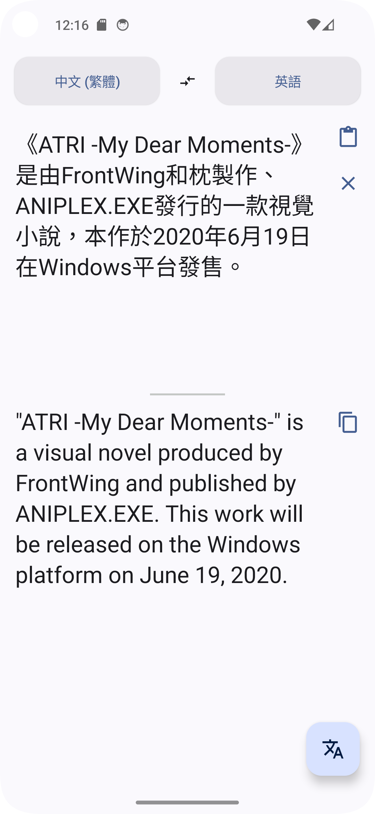
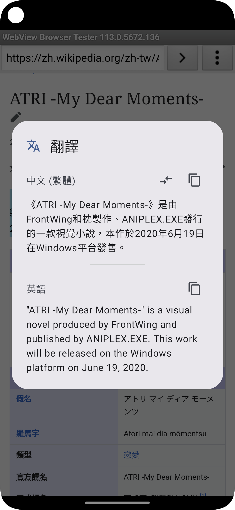

# Translate

**Translate** is a super lightweight translate application.

## Features

*   **Lightweight:** The app size is under 10MB.
*   **Privacy-Friendly:** Use [simplytranslate](https://simplytranslate.org/) as the backend.
*   **Clean UI:** A simple interface that anyone can easily use.
*   **Support 21 commonly used languages:** Chinese (Traditional), Chinese (Simplified), English, Japanese, Korean, French, German, Spanish, Italian, Russian, Portuguese, Vietnamese, Thai, Indonesian, Malay, Arabic, Hindi, Turkish, Ukrainian, Dutch, Polish
    
## Screenshots
 

## Special thanks
**[Translate you](https://github.com/you-apps/TranslateYou)** provided me with a lot of development inspiration

## License
Licensed under the **MIT License**.
